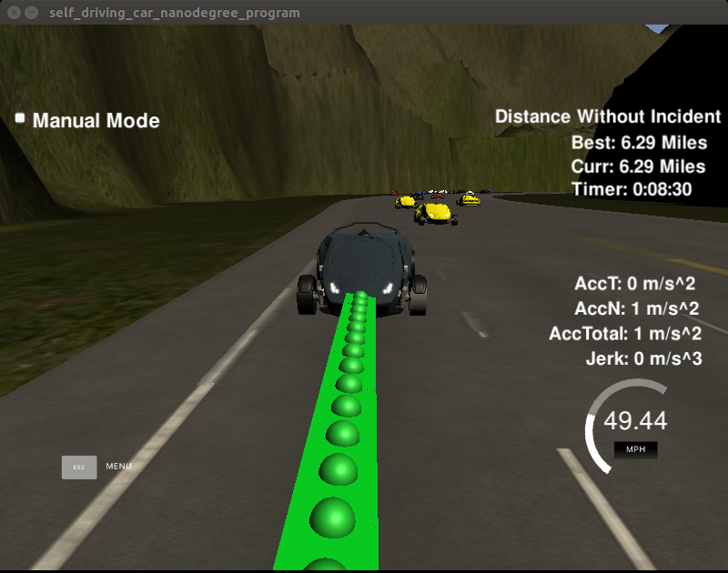

# CarND-Path-Planning-Project
Self-Driving Car Engineer Nanodegree Program
 
   
### Simulator.
The Term3 Simulator which contains the Path Planning Project is available for download at [releases tab (https://github.com/udacity/self-driving-car-sim/releases/tag/T3_v1.2).


### Goals
In this project the goal is to safely navigate around a virtual highway with other traffic that is driving +-10 MPH of the 50 MPH speed limit. The car's localization, sensor fusion data and a sparse map list of waypoints around the highway are provided. The car should try to go as close as possible to the 50 MPH speed limit, which means passing slower traffic when possible, note that other cars will try to change lanes too. The car should avoid hitting other cars at all cost as well as driving inside of the marked road lanes at all times, unless going from one lane to another. The car should be able to make one complete loop around the 6946m highway. Since the car is trying to go 50 MPH, it should take a little over 5 minutes to complete 1 loop. Also the car should not experience total acceleration over 10 m/s^2 and jerk that is greater than 10 m/s^3.


## Basic Build Instructions

1. Clone this repo.
2. Make a build directory: `mkdir build && cd build`
3. Compile: `cmake .. && make`
4. Run it: `./path_planning`.


## Dependencies

* cmake >= 3.5
  * All OSes: [click here for installation instructions](https://cmake.org/install/)
* make >= 4.1
  * Linux: make is installed by default on most Linux distros
  * Mac: [install Xcode command line tools to get make](https://developer.apple.com/xcode/features/)
  * Windows: [Click here for installation instructions](http://gnuwin32.sourceforge.net/packages/make.htm)
* gcc/g++ >= 5.4
  * Linux: gcc / g++ is installed by default on most Linux distros
  * Mac: same deal as make - [install Xcode command line tools]((https://developer.apple.com/xcode/features/)
  * Windows: recommend using [MinGW](http://www.mingw.org/)
* [uWebSockets](https://github.com/uWebSockets/uWebSockets)
  * Run either `install-mac.sh` or `install-ubuntu.sh`.
  * If you install from source, checkout to commit `e94b6e1`, i.e.
    ```
    git clone https://github.com/uWebSockets/uWebSockets 
    cd uWebSockets
    git checkout e94b6e1
    ```
## [Rubric](https://review.udacity.com/#!/rubrics/1971/view) points
### Compilation
Code must compile without errors with cmake and make.

```
make clean; make
[ 50%] Building CXX object CMakeFiles/path_planning.dir/src/main.cpp.o
[100%] Linking CXX executable path_planning
[100%] Built target path_planning
```
### Valid Trajectories

#### The car is able to drive at least 4.32 miles without incident.

* Following is the screenshot of a test run:





#### The car drives according to the speed limit.
* The car speed could get up to a limit of 49.5 mph set at line 435 of [main.cpp](./src/main.cpp)
```
  const double MAX_REF_SPEED       = Mph2mps(49.5); //m/s
```
#### Max Acceleration and Jerk are not Exceeded.
* For the car to not exceed a total acceleration of 10 m/s^2 and a jerk of 10 m/s^3, the maximum acceleration/deceleration used in the code was set to 5 m/s^2 at line 434 of [main.cpp](./src/main.cpp)
```
  const double MAX_ACCELERATION    = 5.0;           //m/s2
```
#### Car does not have collisions.
* The car did not collide with other cars on the road in the test run. The safety distance was set as following at lines 437 and 438 of [main.cpp](./src/main.cpp)
```
  const double SAFE_FRONT_DISTANCE = 30.0;
  const double SAFE_REAR_DISTANCE  = 20.0;
```

#### The car stays in its lane, except for the time between changing lanes.

* The car did not spend more than a 3 second length out side the lane lanes during changing lanes, and every other time the car stays inside one of the 3 lanes on the right hand side of the road.


#### The car is able to change lanes
* The car was able to smoothly change lanes when it makes sense to do so, such as when behind a slower moving car and an adjacent lane is clear of other traffic.


### Reflection
The code model for generating paths is described in detail.